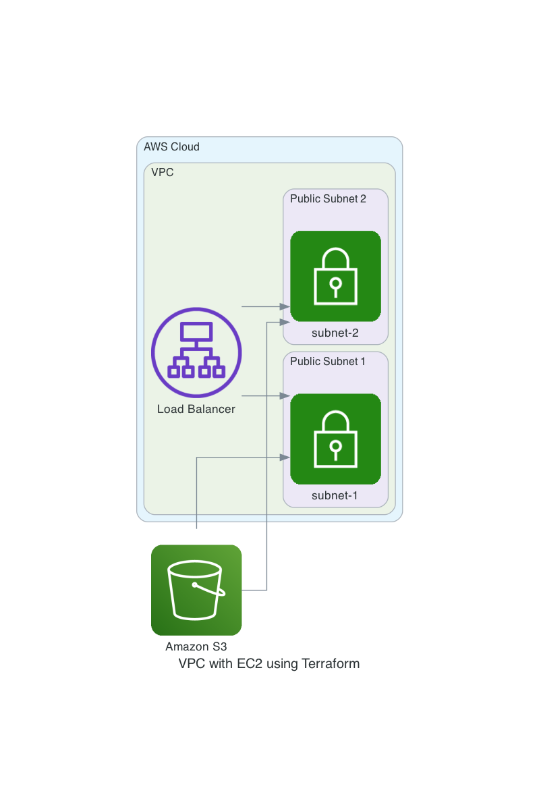

# VPC WITH EC2 ON AWS




**NOTE:** For security concerns, `terraform.tfvars should never be pushed to GitHub`. Same process has been followed here as a part of best practices. The values in terraform.tfvars will overwrite default values in variables.tf. The same `terraform.tfvars looks like this`:

```shell
vpc_cidr_block = "10.0.0.0/16"
vpc_tag = "my-vpc"
sub1_cidr_block = "10.0.0.0/24"
sub1_az = "us-west-1a"
sub1_public_ip_map = true
sub_1_tag = "subnet-1"
.
.
.
```


     


### REFERENCES:
https://www.youtube.com/watch?v=Koabqyopqns&list=PLdpzxOOAlwvLNOxX0RfndiYSt1Le9azze&index=27