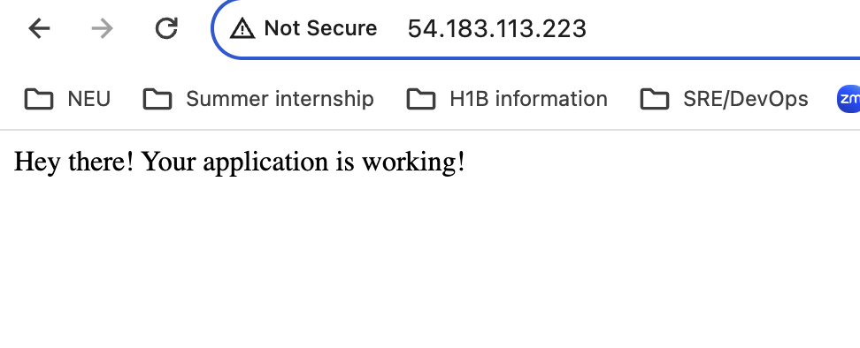

Delving deeper into the `file`, `remote-exec`, and `local-exec` provisioners in Terraform, along with examples for each.

1. **file Provisioner:**

   The `file` provisioner is used to copy files or directories from the local machine to a remote machine. This is useful for deploying configuration files, scripts, or other assets to a provisioned instance.

   Example:

   ```hcl
   resource "aws_instance" "example" {
     ami           = "ami-0c55b159cbfafe1f0"
     instance_type = "t2.micro"
   }

   provisioner "file" {
     source      = "local/path/to/localfile.txt"
     destination = "/path/on/remote/instance/file.txt"
     connection {
       type     = "ssh"
       user     = "ec2-user"
       private_key = file("~/.ssh/id_rsa")
     }
   }
   ```

   In this example, the `file` provisioner copies the `localfile.txt` from the local machine to the `/path/on/remote/instance/file.txt` location on the AWS EC2 instance using an SSH connection.

2. **remote-exec Provisioner:**

   The `remote-exec` provisioner is used to run scripts or commands on a remote machine over SSH or WinRM connections. It's often used to configure or install software on provisioned instances.

   Example:

   ```hcl
   resource "aws_instance" "example" {
     ami           = "ami-0c55b159cbfafe1f0"
     instance_type = "t2.micro"
   }

   provisioner "remote-exec" {
     inline = [
       "sudo yum update -y",
       "sudo yum install -y httpd",
       "sudo systemctl start httpd",
     ]

     connection {
       type        = "ssh"
       user        = "ec2-user"
       private_key = file("~/.ssh/id_rsa")
       host        = aws_instance.example.public_ip
     }
   }
   ```

   In this example, the `remote-exec` provisioner connects to the AWS EC2 instance using SSH and runs a series of commands to update the package repositories, install Apache HTTP Server, and start the HTTP server.

3. **local-exec Provisioner:**

   The `local-exec` provisioner is used to run scripts or commands locally on the machine where Terraform is executed. It is useful for tasks that don't require remote execution, such as initializing a local database or configuring local resources.

   Example:

   ```hcl
   resource "null_resource" "example" {
     triggers = {
       always_run = "${timestamp()}"
     }

     provisioner "local-exec" {
       command = "echo 'This is a local command'"
     }
   }
   ```

   In this example, a `null_resource` is used with a `local-exec` provisioner to run a simple local command that echoes a message to the console whenever Terraform is applied or refreshed. The `timestamp()` function ensures it runs each time.

### Project work output:
