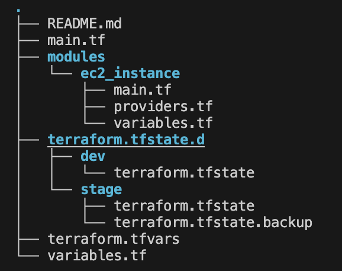

## TERRAFORM WORKSPACES

- Can come in handy when dealing with multiple environments
- If you do not make the use of workspaces, there will be only one tfstate file
- Even if you have separate tfvars file for each environment (eg: dev.tfvars, stage.tfvars, prod.tfvars), if you don't use workspaces, terraform will modify the same infrastructure each time you pass the different tfvars file as an argument to the command i.e. `terraform apply -var-file=dev.tfvars`. This happens because it has only one tfstate file
- To resolve this issue, terraform has something called as `workspaces` which separates your environments by maintaining separate tfstate file for each of them
- To create a new workspace

   ```shell
   terraform workspace new <name>
   ```

- To switch to a different workspace

   ```shell
   terraform workspace select <name>
   ```

- After you create workspaces, the file structure looks like this:

   

   - As we can see, there are two different states being maintained by terraform for each workspace
   - This will provide isolation between the infrastructure of different workspaces/environments